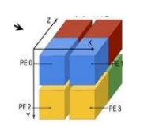
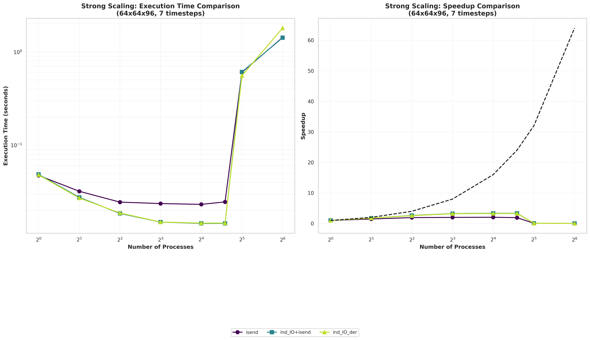
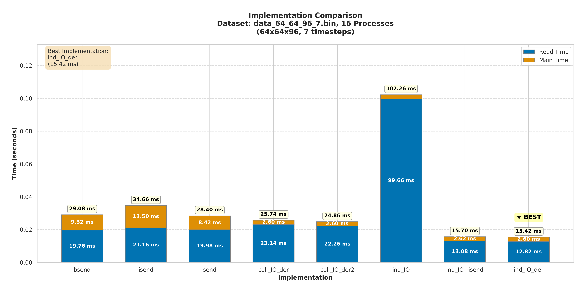
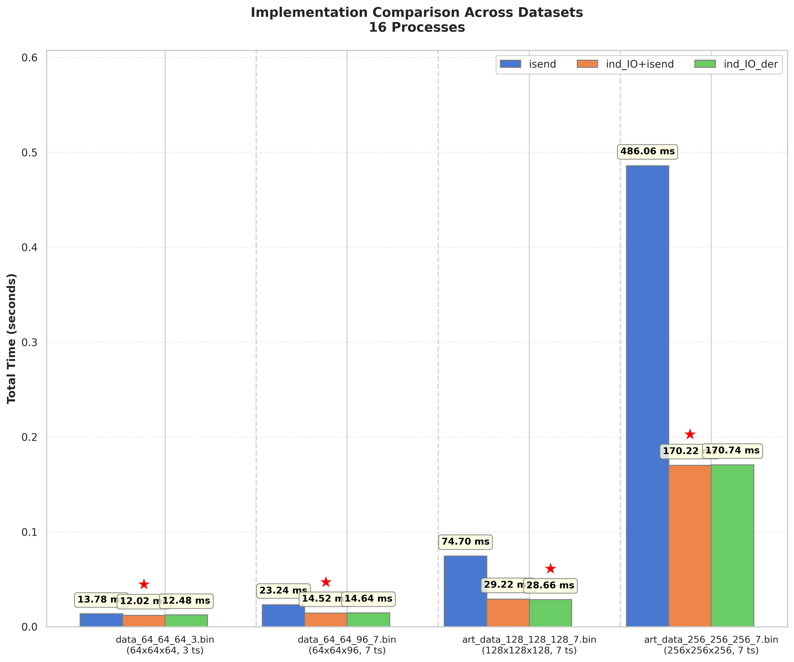

# 3D Time-Series Data Analysis with MPI



## 📋 Overview

This repository contains an MPI-based C implementation to efficiently detect local minima and maxima in large 3D time-series datasets by decomposition of the spatial domain and adaptive I/O and communication strategies.

Key features:

* **3D Domain Decomposition** with ghost (halo) zones for boundary handling
* **Adaptive I/O Strategy**: independent parallel I/O via MPI file views (≤24 processes) and root-based non-blocking distribution (>24 processes)
* **Local Extrema Detection** purely in parallel—no communication during core computation
* **Global Aggregation** via MPI collective operations (MPI\_Reduce)
* **Benchmarking & Visualization** scripts to compare performance of various implementations

## 📂 Project Structure

```
.
├── src/
│   ├── send.c                       # Basic implementation using blocking MPI Send
│   ├── isend.c                      # Implementation using non-blocking MPI Isend
│   ├── bsend.c                      # Implementation using buffered MPI Bsend
│   ├── collectiveIO.c               # Implementation using collective MPI I/O
│   ├── collectiveIO_derData.c       # Enhanced collective I/O with file view
│   ├── independentIO.c              # Implementation using independent I/O
│   ├── independentIO_derData.c      # Independent I/O with file view
│   ├── independentIO_derData_and_isend.c  # Best hybrid implementation
│   ├── Makefile                     # Compilation instructions
│   └── bin/                         # Compiled executables
├── jobs/
│   ├── job1.sh                      # Job script for benchmark 1
│   ├── job2.sh                      # Job script for benchmark 2
│   ├── ...
│   └── job7.sh                      # Job script for best method
├── results/
│   └── job*_results/                # Result directories
│       ├── raw/                     # Raw output files
│       └── benchmark_results.csv    # Performance metrics
├── scripts/
│   └── visualize.py                 # Visualization script
└── assets/
    └── job*_images/                 # Generated visualizations
```

## 🛠️ Prerequisites

* MPI implementation (e.g., OpenMPI or MPICH)
* C compiler (gcc or clang)
* Python 3 with matplotlib and pandas (for visualization)
* Slurm or another job scheduler (optional, for batch runs)

## 🚀 Build & Run

### 1. Compile All Implementations

```bash
cd src/
make all
```

This produces executables in `src/bin/` for each variant.

### 2. Run Best-Performing Method

```bash
cd jobs/
sbatch job7.sh
```

* Outputs are placed in `results/job7_results/raw/`.
* Naming: `output_NX_NY_NZ_TIMESTEPS_PROCS.txt`

### 3. Run Benchmarks for All Variants

```bash
cd jobs/
for job in job1.sh job2.sh job3.sh job4.sh job5.sh job6.sh; do
  sbatch "$job"
done
```

* Each creates `results/jobX_results/benchmark_results.csv`.

### 4. Generate Visualizations

```bash
cd scripts/
python3 visualize.py ../results/job1_results/benchmark_results.csv ../assets/job1_images
# Repeat for job2 through job6
```

## 🔍 Implementation Variants

| Script                          | Description                                                  |
| ------------------------------- | ------------------------------------------------------------ |
| `send.c`                        | Blocking MPI\_Send based data distribution                   |
| `isend.c`                       | Non-blocking MPI\_Isend distribution                         |
| `bsend.c`                       | Buffered MPI\_Bsend distribution                             |
| `collectiveIO.c`                | Collective MPI I/O without file view                         |
| `collectiveIO_derData.c`        | Collective I/O with derived datatypes and file view          |
| `independentIO.c`               | Independent MPI I/O without file view                        |
| `independentIO_derData.c`       | Independent I/O with derived datatypes and file view         |
| `independentIO_derData_isend.c` | Hybrid best-performing: independent I/O & non-blocking sends |


## Performance Analysis

### Scaling Performance

The implementation shows strong scaling up to 24 processes, after which performance decreases due to system limitations:



### Implementation Comparison (16 Processes)

Performance comparison of different implementation strategies:



### With Varying Dataset Sizes
Comparison of MPI_Isend, Independent IO, and the hybrid approach shows that the hybrid implementation consistently performs best across all dataset sizes.



## License

[MIT License](LICENSE)
